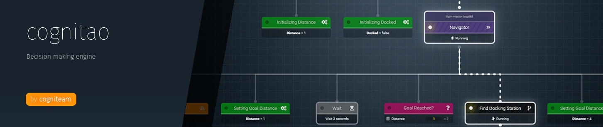
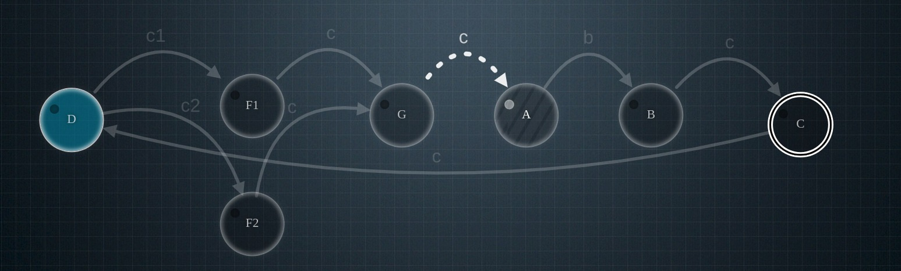
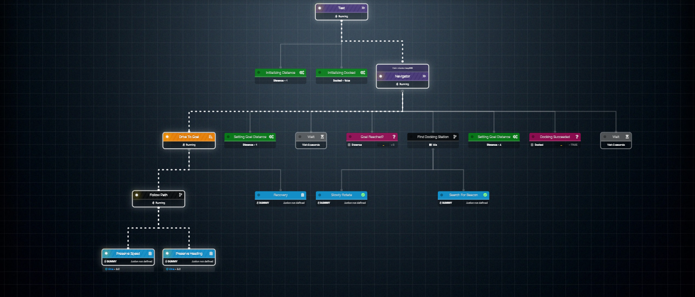
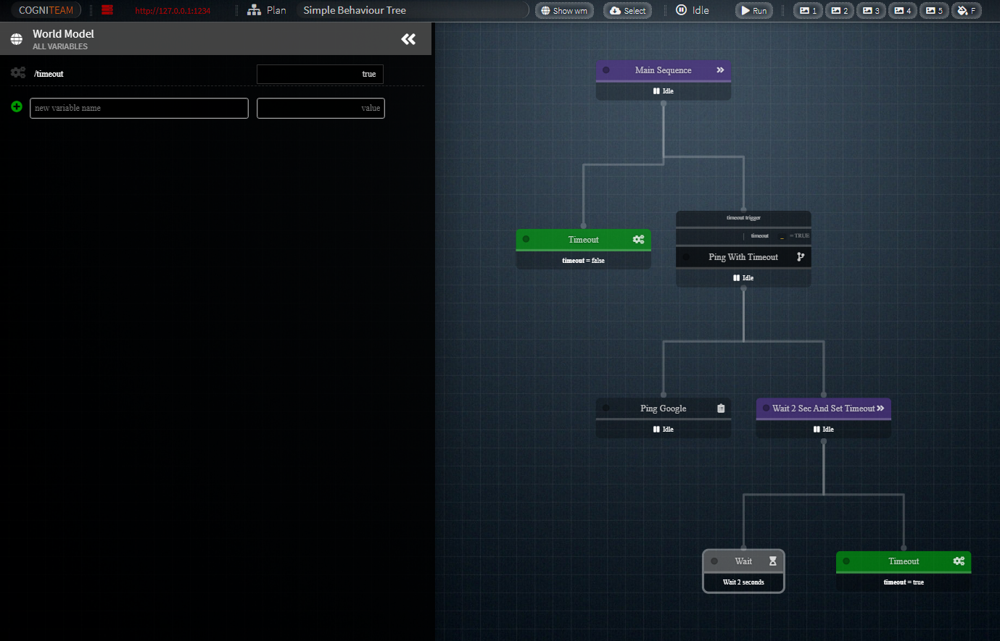
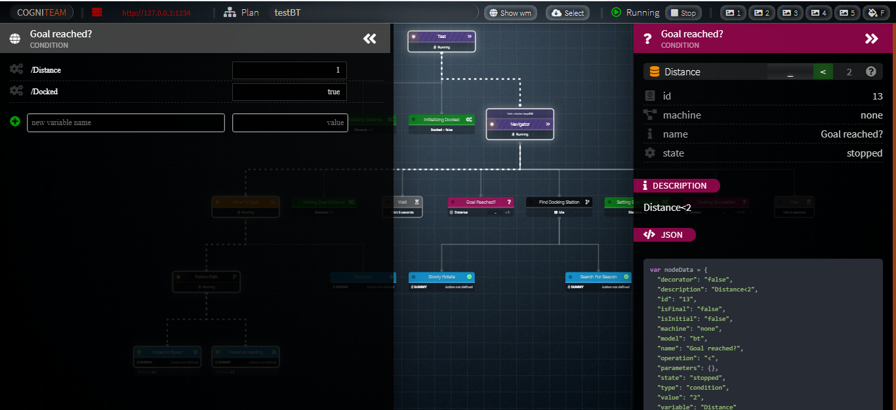

# CogniTao Examples

* Make sure cognitao library is installed
* For cognitao ROS1 examples see https://git.cogni.io/cognitao/cognitao_ros_examples .
* For cognitao ROS2 examples see https://git.cogni.io/cognitao/cognitao_ros2_examples .


## High level Components 
* Task : A task is the basic execution building block (task execution description) in CogniTao graph.
* Machine : A machine is a collection of tasks ordered in a graph and connected by execution protocols (flow logic description). Machines for FSM and BT logic are implemented in the library. 
* Runner : Tasks have runners in order to execute user code (actions). A local runner is used
by CogniTao in order to execute a registered action when linking directly to the library.
A remote runner is used to connect CogniTao to remote running tasks (remote to the library).
CogniTao has plugins for ROS and ROS2 runners.   
* World Model :  The world model is a process and thread safe key/value mechanism that enables subscription to information change. 
  * Across process UDP multi casting is used to sync several world models. Within the process thread safety is used. 
  * Distributed world models are synchronized out of the box using udp/ros/ros2.
  * cognitao_wmm can be used to monitor several worldmodels
```bash
$ export COGNITAO_DATASOUCE="udp"
$ cognitao_wmm
```
  * The worldmodel is also accessible through a webserver at 127.0.0.1:1234/wm
* DataSource : The protocol used to sync several worldmodels. The default one is udp, however ros and ros2 datasources are available as plugins in CogniTao.

## Running a machine 
```
$ cognitao_server <path to xml>
```

## Programmatically Loading a machine from XML
```cpp
Machine* machineHandler;
machineHandler = MachineXMLReader::read(path);
machineHandler->start();
```

## State Machine


### Syntax
```xml
<machine name="Simple 3 states FSM" type="fsm">
	<state initial="A" final="C">
		<state id="A">
			<transition event="b" target="B"></transition>
		</state>
		<state id="B">
			<transition event="c" target="C"></transition>
		</state>
		<state id="C">
		</state>
	</state>
</machine>
```
### Logic
* In the example a 3 states (A->B-C) graph is described where A is an initial state and C is a final state
* Transitions can be triggered through the wordmodel on /a, /b, /c by setting any value on these paths. 
* Machines can be used heirarchically (states can have machines)


### 2 states example
* In this example a simple state machine is constructed from code [FSM](src/example_state_machine.cpp)
```cpp
auto s1 = new StateEmpty("locked",params);
auto s2 = new StateEmpty("unlocked",params);

MachineFSM *machineHandler = new MachineFSM();
auto E1 = new ProtocolTransition ({"PUSH"});
auto E2 = new ProtocolTransition ({"COIN"});
machineHandler->setInitialTask(s1);
s1->addEdge(s2,E2);
s2->addEdge(s1,E1);
```


### Canonical turnstile example
* In this example a state machine is constructed from code [FSM](src/example_state_machine_turnstile.cpp)
```cpp
auto s1 = new StateEmpty("locked",params);
auto s2 = new StateEmpty("unlocked",params);

MachineFSM *machine = new MachineFSM();
auto E1 = new ProtocolTransition ({"PUSH"});
auto E2 = new ProtocolTransition ({"COIN"});
auto E3 = new ProtocolTransition ({"PUSH"});
auto E4 = new ProtocolTransition ({"COIN"});
machine->setInitialTask(s1);
s1->addEdge(s2,E2);
s2->addEdge(s1,E1);
s1->addEdge(s1,E3);
s2->addEdge(s2,E4);
```

## Behavior trees



### Behaviour tree simple example
* In the example below a shell task is beeing invoked and managed, to ping goolge.
* Ping usually takes 4sec, however we want to stop it after 2 sec
* A trigger is set, and parallel to the ping we wait 2 sec, and set a value in the world model
* That value is used to trigger the stop condition
### Syntax
```xml
<machine name="Simple Behaviour Tree" type="bt">
    <sequencer name="main sequence">
        <set name="timeout" variable="timeout" value="false"/>
        <trigger name="timeout trigger" stop_condition="timeout = true">
            <parallel name="Ping with timeout">
                <shell name="ping google" command="ping" args="google.com -c 10"/>
                <sequencer name="wait 1 sec and set timeout">
                    <wait name="ping wait" value="2"/>
                    <set name="timeout" variable="timeout" value="true"/>
                </sequencer>
            </parallel>
        </trigger>
    </sequencer>
</machine>
```
* Tree shown in the cognitao MachineWebServer at the end of the run
* When done running, the timeout will be true


### Behaviour classes supported
* ```<sequencer>``` sequencer
* ```<selector>``` selector
* ```<random_selector>``` random_selector
* ```<parallel>``` parallel
* ```<loop>``` loop
  * attribute :value (integer)
* ```<behaviour>``` behaviour task
  * attribute name
* ```<inverter>``` inverter
* ```<succeder>```  succeder
* ```<failer>```  failer
* ```<wait>``` wait
  * attribute :value (integer/seconds)
* ```<condition>``` condition
  * attribute :variable (WM)
  * attribute :operation =,>,<,>=,<=,!=
  * attribute :value
  * attribute :expression (expression in Variable::Operator::Value form)
* ```<set>``` set WM variable
  * attribute :variable (WM)
  * attribute :value
* ```<trigger>``` returns condition triggerring or child task return value
  * attribute :variable (WM)
  * attribute :operation =,>,<,>=,<=,!=
  * attribute :value
  * attribute :value
  * attribute :start_condition (expression in Variable::Operator::Value)
  * attribute :stop_condition (expression in Variable::Operator::Value)
* ```<shell>``` runs a separate process as a task
  * attribute :command 
  * attribute :args

### Construction from code 
* In this example a behaviour tree is constructed from code [behavior tree](src/example_behavior_tree_construction.cpp)
```cpp
//Declare nodes 
auto loop =     new BehaviourLoop(loop_name,1);
auto sequencer = new BehaviourSequencer(sequencer_name); // runs childs in sequence
auto selector = new BehaviourSelector(selector_name); // runs childs in sequence
auto b1 = new BehaviourSucceder("Ok"); // returns true
auto b2 = new BehaviourSucceder("Ok"); // returns true
auto b3 = new BehaviourFailer("NOk"); // returns false
auto b4 = new BehaviourSucceder("Ok"); // returns true
auto time = new BehaviourSet("TIME","Now is the time"); // sets X to the value of the WM::time
auto wait1 = new BehaviourWait("waiting 1...",2); // waits 2 seconds
auto wait2 = new BehaviourWait("waiting 2...",2); // waits 2 seconds
auto wait3 = new BehaviourWait("waiting 3...",2); // waits 2 seconds
auto wait4 = new BehaviourWait("waiting 4...",2); // waits 2 seconds
//Build tree
loop->addEdge(sequencer);
//SEQUENCERS will coontinue while tasks succeed
sequencer->addEdge(b1);
sequencer->addEdge(wait1);
sequencer->addEdge(b2);
sequencer->addEdge(wait2);
sequencer->addEdge(time);
sequencer->addEdge(selector);
//SELECTOR will stop after wait3 succeeds
selector->addEdge(b3);
selector->addEdge(wait3);
selector->addEdge(b4);
selector->addEdge(wait4);
//Set the machine initial task
machineHandler->setInitialTask(loop);
```

### Using a behaviour trigger on the WorldModel  
* In this example a behaviour trigger is used to stop an endless task [behavior tree](src/example_behavior_tree_trigger.cpp). 
```cpp
Machine *machineHandler = new MachineBT();
// trigger will stop the subtree with success once condition in met
auto trigger = new BehaviourTrigger("event","=","true");
// wait an hour
auto wait = new BehaviourWait("waiting",3600);
trigger->addEdge(wait);
machineHandler->setInitialTask(trigger);
```

### Return values from machines and exception handling  
* In this example a 3 behaviour trees are constructed from code [behavior tree](src/example_behavior_tree_return_exceptions.cpp). One succeeds, one fails, and one ends with an exception. 

## Runner examples 
### Using the local runner to run your c++ functions 
* In this example a local runner is used to run  registered actions [local runner](src/example_behavior_tree_user_actions.cpp)
```cpp
class UserFunctions{
public:
    bool wait_forever(Task* b)
    {
        // get parameters written in the XML in the form of 
        // < .... param_<name>="value">
        cout << "PARAMETERS :" << endl;
        for(auto param : b->getParameters())
        {
            cout<< param.first << " " << param.second << endl;
        }    
        while(!b->isStopRequested())
        {
            std::this_thread::sleep_for(std::chrono::milliseconds(1));
        }	
        return true;
    }
};

// Registering BehaviourTask actions defined by the user
// These will be called when runner="local" and action="some_method"
// defined in UserFunctions::some_method
// For example in the following tag in the XML
// <task name="Report" runner="local" action="wait_random"/>
// <task name="Report" runner="local" action="wait_and_print" param_input="HELLO WORLD!"/>
Action::registerAction("wait_forever", &UserFunctions::wait_forever, userFunctions);
```

### Creating a custom runner
* In this example a custom runner is defined and registered [custom runner](src/example_behavior_tree_runner.cpp)
  * In order to run ./build/cognitao_example_behavior_tree_runner assets/example_behavior_tree_runner.xml 

### Creating a runner plugin for cognitao_server
* In this example a custom runner plugin is defined and compiled into a shared object [runner plugin](src/example_runner_plugin.cpp)
* From then on it can be loaded at runtime using PluginLoader::loadPlugin()
  * (Locally) cognitao_server will look for a local plugin folder, and then continue
  * (Linux) runners are defaulty installed in /usr/lib/cognitao/plugins 
  * (Windows) runners are defaulty installed in C:\Program Files\CogniTao\plugins 

## Monitoring a CogniTao machine


### CogniTAO MachineTraceWriter
```cpp
cout << MachineTraceWriter::writeExecutionTrace(machineHandle) << endl;
```

### CogniTAO MachineWebServer
* If cognitao_server is running an XML file, the default server will be on port 1234.
* Otherwise the UI server can be created by passing it a machine pointer.
```cpp
 MachineWebServer webServer("0.0.0.0", "1234", machineHandle);
```

### Runner examples 
## build your own runner 
In this example a custom runner is used. This enables to write the following xml plan 

[custom runner example](src/example_behavior_tree_runner.cpp)

## Build status
[](https://git.cogni.io/cognitao/cognitao_examples/commits/master) **master**

[](https://git.cogni.io/cognitao/cognitao_examples/commits/master) **develop**

## Description
CogniTao decision making library C++ examples